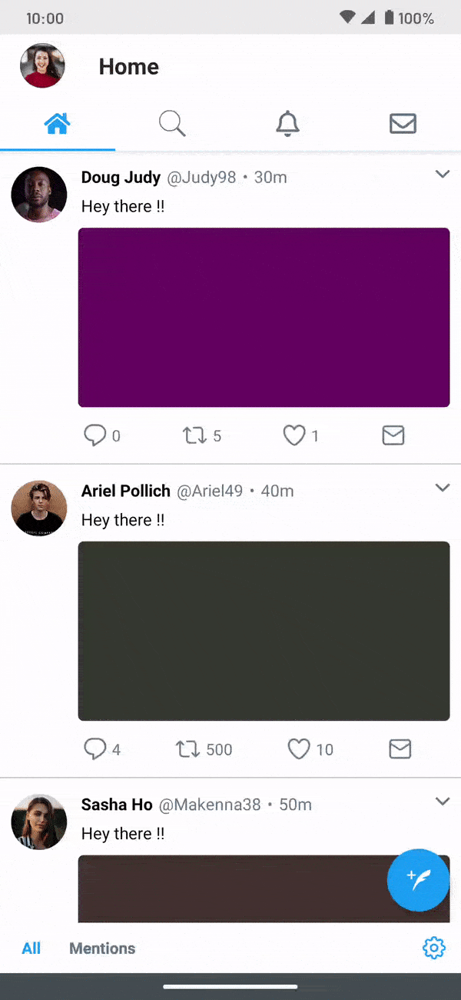

# Twitter UI Clone

This project was built as a part of Hasura Product Development Fellowship (HPDF) in November 2017.

The dependencies have been updated and the project has been migrated to AndroidX in November 2020.

The task allotted was to replicate the _**User Interface** of Twitter's app for Android_ with mock hard-coded data wherever required.

**The UI of the app has been updated in v2 according to the UI of Twitter's Android app v7.24.1**

| Version 1                         | Version 2 (Twitter v7.24.1)       |
| --------------------------------- | --------------------------------- |
|     |     |
| [Apk file](apks/v1/app-debug.apk) | [Apk file](apks/v2/app-debug.apk) |

## Getting Started

### Clone the repository

As usual, you get started by cloning the project to your local machine:

```bash
git clone https://github.com/sdabhi23/HPDF-Task1-Twitter-Clone.git
```

- Now look for the app folder with the version number you want to build (For example, **_app v2_** if you want to build version 2).
- Rename it to **_app_** and delete all the other folders beginning with app (For example, **_app v1_**)
- In the end open your Android Studio and go to **Files > Import Project**.

Alternatively, you can use the **Check out project from Version Control** option in Android Studio to download the project.

## Prerequisites

Having **JDK 8 or higher** installed along side **Android Studio 3.0 or higher** is a major prerequisite as lambda expressions used in this project are not supported in the older versions of JAVA and Android Studio.

## Android Versioning Information

| Specification         | Setting             |
| --------------------- | ------------------- |
| Target SDK Version    | 30 (Android Oreo)   |
| Minimum SDK Version   | 19 (Android KitKat) |
| Build Tools Version   | 26.0.2              |
| Gradle Version        | 6.7.1               |
| Gradle Plugin Version | 4.1.1               |

## Libraries used

- [Android-Iconics](https://github.com/mikepenz/Android-Iconics) for the UI icons
- [MaterialDrawer](https://github.com/mikepenz/MaterialDrawer) for the side navigation drawer
- [RoundedImageView](https://github.com/vinc3m1/RoundedImageView) for the rounded images
